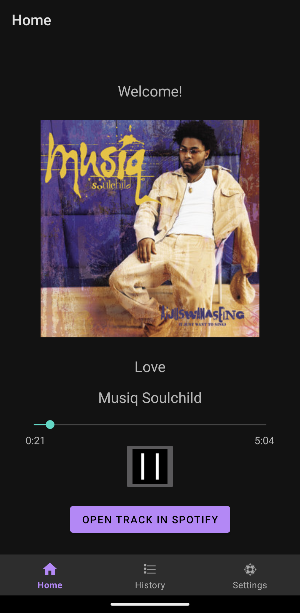
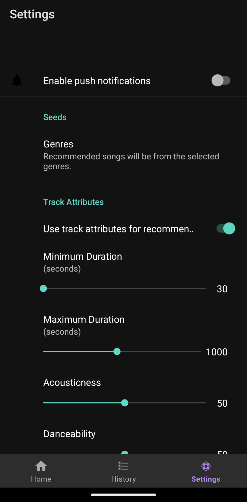

# State of the App (Changes to Spotify Web API)
On November 27th, 2024, [Spotify deprecated multiple endpoints of their Web API](https://developer.spotify.com/blog/2024-11-27-changes-to-the-web-api). As part of these changes, Spotify's "recommendations" endpoint is no longer functional, and thus Song of the Day is no longer functional for its intended purpose. For this reason, development of this project will indefinitely cease.

For anyone looking at this project to evaluate my project experience, I ask that you take the implied functionality in the screenshots below in good faith as I was unable to record a video demonstration before Spotify changed their Web API. By my estimation, this project was about 95% complete in terms of core functionality.

___

# Song of the Day - SOTD

### What is SOTD?
Song of the Day - SOTD is an Android mobile application that serves the user one song recommendation per day via integration with the Spotify Web API.

### Why use SOTD?
SOTD helps you discover and develop your taste in music via the hand of fate. When handed a single song, you might be more likely to give it an earnest listen than if you had to wade through a sea of recommendations on Spotify.

SOTD also allows you to nudge your recommendations in various directions via in-app settings where you can toggle genres and prioritize certain sounds, styles, tempos, and durations.

___
### Home Page as of Jul. 22, 2024
All controls are functional and song data is retrieved via Spotify Web API.

### History Page as of Oct. 14, 2024
All controls are functional and previous recommendation data is retrieved from the database.

### Settings Page as of Apr. 7, 2024
All genre and track attribute controls are functional and their values are accounted for when requesting recommendations from Spotify.

*"Genres" opens a list of available genres to select from.*

*Not all controls are displayed here.*

___

Design documents and developer journal contents are included in the repo for demonstrative purposes.
