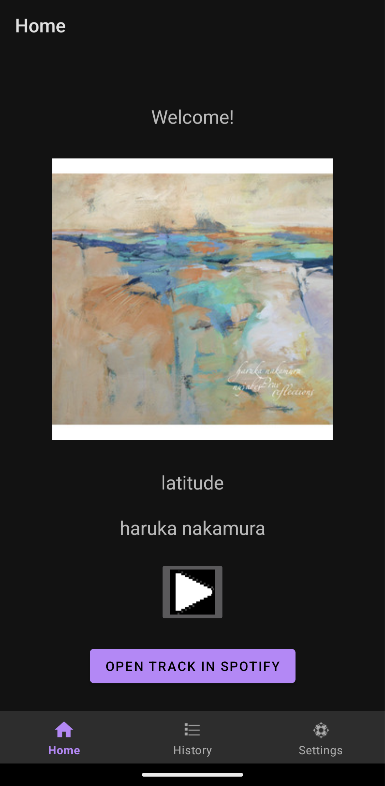

The purpose of most of these changes is to make HomeFragment's UI more complete.

# Changes
### Added elements to HomeFragment's UI
- Cover Art (ImageView)
- Song Title (TextView)
- Artist Name (TextView)
- Play/Pause Button (ImageButton)

### [Opening Spotify content in the Spotify app](https://developer.spotify.com/documentation/android/tutorials/content-linking)
Open in Spotify button opens the Spotify app on the user's device.
- Currently, there is no checking for an installed Spotify app (there should be).

### [Making Remote Calls](https://developer.spotify.com/documentation/android/tutorials/making-remote-calls)
Play/Pause button controls playback remotely.

### Moved data to the view model
Cover art image, song title text, and artist name text; all of these are subject to change based on the current song recommendation. Since they aren't burned in, I moved their data to the HomeFragment view model.

### Changed icons for the History and Settings fragments
I replaced the icons for HistoryFragment and SettingsFragment with new ones that I made in Aseprite.

### Added Picasso library to download Cover Art by URL
https://square.github.io/picasso/
TrackService now retrieves a URL pointing to the track's 300x300 Cover Art. Picasso loads the image from that URL into the ImageView.

# Updated HomeFragment UI

# Additional Thoughts
- HomeFragment still needs a playtime bar to track where Spotify is in the song.
- There are encapsulation violations due to HomeFragment's reliance on the SpotifyAppRemote in MainActivity. I toyed around with moving the remote to HomeFragment, but ran into issues and I intend to look into it at another time.
- Track info doesn't load on initial start-up of HomeFragment, but loads after switching to another fragment and back to HomeFragment. This is a bug, but otherwise the track info does load as intended.