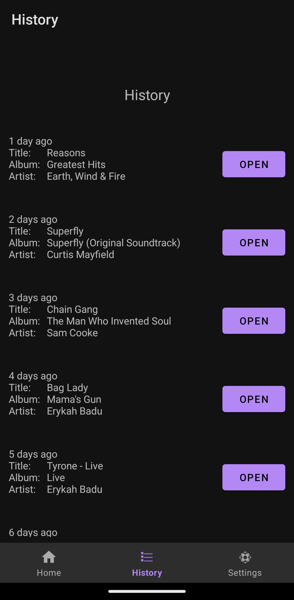

# Purpose
The history page needs some love. It's time to give it an upgrade.

# Changes
### Added "Open" Button for each item in History list
- Changed history_row_item.xml layout from FrameLayout to ConstraintLayout
	- ConstraintLayout is a more appropriate layout to use when aligning two elements on the same row (FrameLayout is apparently good for containing single child elements). RelativeLayout was another option I considered, but I chose to go with ConstraintLayout due to my familiarity with it.
- "Open" button opens the related track in the user's Spotify app.
	- The RecyclerView Adapter now takes in an array of Track objects. 
		- This way, we can use each Track's info to format the history item's TextView text, and we can directly get the Track's URI when setting each "Open" button's onClick behavior.
		- This change also makes it easier to add new elements to each row in the history (if I ever decide to do so).
	- The openTrackInSpotify method has been moved to a new class, currently called SpotifyHelper (maybe too vague of a name), so that one implementation can be used for opening tracks in both Home and History.
### Updated format of track info
- Changed the first item to say "1 day ago" instead of "1 days ago."
- Added tab characters after "Title:", "Album:", and "Artist:" to increase readability.
	- This doesn't look great for long Strings. I think making new UI Labels and TextViews for title, album, and artist might be a better way to handle spacing issues, but I am choosing to leave that for another time.

# Misc
- Formatting of the track info that the RecyclerView Adapter (HistoryAdapter) uses is now done in the Adapter itself instead of the initDataSet method in HistoryFragment. This change was made to simplify the type of data that goes into the Adapter (now just an array of Track objects instead of two String arrays, one being formatted track info strings, and one being track URIs). I'm unsure if this is a positive change in regards to method/class responsibilities, but I believe it makes the code easier to read.

# Updated HistoryFragment UI
